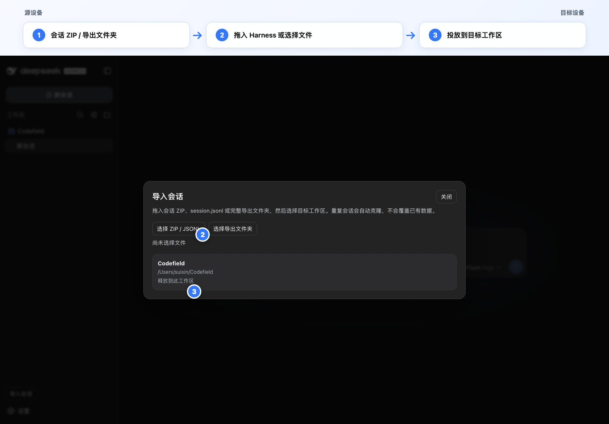
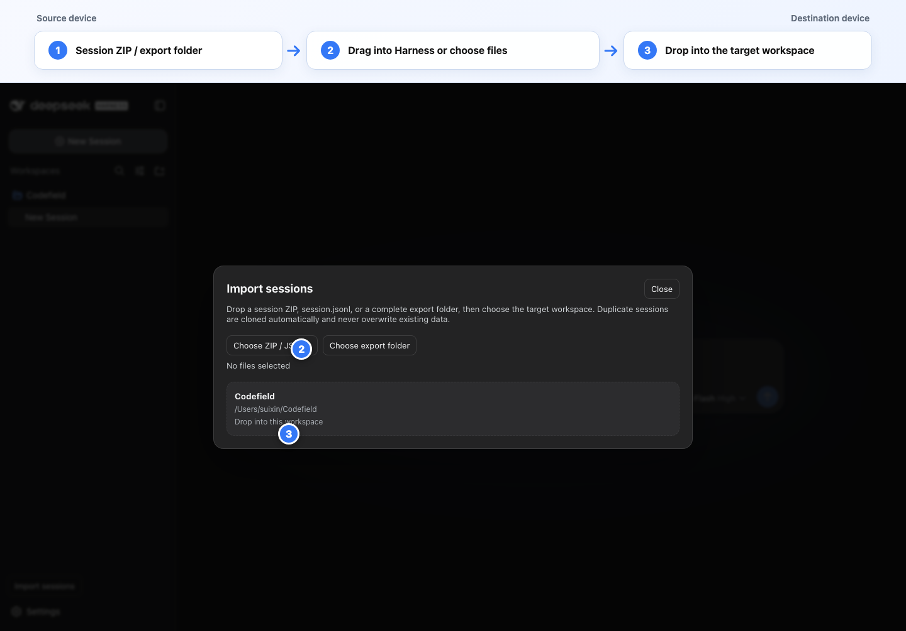

# dsh-session-migrator

[English](README.md) | 简体中文

一个用于 [DeepSeek Harness](https://github.com/deepseek-ai/deepseek-harness) 的可视化跨设备会话迁移插件。在一台设备导出会话后，可以在另一台设备把 ZIP、JSONL 或解压后的导出文件夹导入到指定工作区。



## 主要能力

- **可视化操作**：直接使用侧栏入口，无需记忆命令。
- **拖拽导入**：把 Harness 会话 ZIP、`session.jsonl` 或完整导出文件夹拖入页面，再选择目标工作区。
- **跨设备工作区映射**：将所有导入会话的 `cwd` 重写为目标工作区。
- **完整会话树**：同时导入根会话和全部 `subagents/<id>/session.jsonl` 后代。
- **安全重复导入**：永远不覆盖已有会话。检测到任一 ID 冲突时，会为整棵树生成新 ID，并同步重写父子关系和 Harness 来源引用。
- **附件迁移**：恢复日志引用的 PNG、JPEG、WebP 和 GIF，并校验内容寻址 ID。
- **Harness 原生校验**：通过 `decodeStorageRecord()` 解码存储记录，并用 `Session.create()` 验证每一份重建日志后才写入。
- **原标题立即显示**：导入时预热 Harness 投影缓存，无需先打开会话，工作区列表就能直接显示其持久化标题。
- **中英文界面**：自动跟随 Harness 当前语言。
- **命令行备用方案**：仍可通过 `/session-import` 处理本地或脚本化工作流。

## 使用条件

- DeepSeek Harness `0.1.1-rc.2` 或兼容版本。
- 目标设备上的目标工作区目录必须已经存在。
- 会话导出不包含项目源文件；项目本身需要通过 Git 或其他同步方式单独迁移。

## 安装

在运行 Harness 的设备上克隆仓库：

```bash
git clone https://github.com/Suixin04/dsh-session-migrator.git
cd dsh-session-migrator
npm install
npm run build:client
```

安装到 Web Profile：

```bash
dsh plugin --profile web add /absolute/path/to/dsh-session-migrator
```

重启现有的 `dsh web` 进程。随后侧栏底部会出现 **导入会话**。

> 修改 `package.json`、Host 代码或 Profile 组合后必须重启 Harness。仅重建 `client.js` 时，也只有在相应 Client Plugin watcher 正在运行的情况下才可能自动更新。

## 在源设备导出

Harness 已内置会话导出。打开需要迁移的会话，然后：

- 执行 `/export`；或
- 点击会话标题栏中的 **Session log**。

浏览器会下载类似文件：

```text
dsh-session-session-xxxxxxxx.zip
```

导出包通常包含根会话、全部子代理会话以及被引用的图片附件。

## 在目标设备导入

### 可视化导入

1. 点击侧栏底部的 **导入会话**。
2. 选择 ZIP/JSONL、选择完整导出文件夹，或者直接把文件/文件夹拖进 Harness 页面。
3. 点击目标工作区卡片，或把文件释放到目标工作区卡片上。
4. 等待解析、校验和持久化完成。
5. 点击 **打开导入的会话**。

界面会自动跟随 Harness 当前语言：



### 命令导入

使用当前会话所属工作区：

```text
/session-import "/absolute/path/dsh-session-xxx.zip"
```

显式指定另一个已有工作区：

```text
/session-import "/absolute/path/dsh-session-xxx.zip" --workspace "/absolute/path/to/project"
```

也支持解压后的导出目录和单个 JSONL：

```text
/session-import "/path/to/unpacked-export" --workspace "/path/to/project"
/session-import "/path/to/session.jsonl" --workspace "/path/to/project"
```

## 重复会话策略

目标设备不存在冲突时，保留原始会话 ID。

只要任一 ID 已存在，插件就会克隆整棵导入树：

- 每个会话获得新的 UUID；
- 重写 Header 中的 `id` 和 `parentSession`；
- 重写 Harness `senderSessionId` 来源字段；
- 重写导入树内部的结构化 Session Reference；
- 永远不覆盖本地已有日志。

用户或模型撰写的文本、历史工具参数和工具结果文本不会被搜索替换。它们属于不可随意改写的原始对话内容，盲目替换类似会话 ID 的字符串可能破坏语义。如果继续克隆会话时模型尝试复用旧子代理 ID，可先调用 `list_agents` 获取当前克隆树的地址。

## 支持的导出结构

```text
session.jsonl
subagents/
  <session-id>/
    session.jsonl
media/
  <attachment-id>.<png|jpg|jpeg|webp|gif>
```

ZIP 可以额外包含一层顶级目录。导入器在定位根 `session.jsonl` 时会自动识别并移除这一层包装。

## 安全与限制

- 会话导出可能包含完整提示词、模型回复、系统上下文、工具调用、绝对路径和图片，应当视为敏感数据。
- 导入器限制归档体积、JSONL 体积和文件数量，并拒绝不安全路径、重复条目、错误日志、重复 ID、循环父子关系和孤立子会话。
- Harness 持久层是 append-only，目前没有公开删除 API或多会话事务 API。插件会在写入前完整验证归档，但最终写入期间发生存储故障时，已经提交的前缀会话无法自动删除。
- 部分写入后再次导入会生成新的克隆树，操作前应先检查工作区，避免产生不需要的重复副本。
- 插件只迁移会话状态和被引用图片，不迁移项目文件、凭据、模型供应商配置或外部服务。

## 开发

```bash
npm install
npm run build:client
npm test
```

主要文件：

- `index.js`：Host 插件、`/session-import` 和 `POST /api/session.import`。
- `core.js`：解析、校验、附件恢复、ID 重映射和持久化。
- `client-src.js`：React 界面源码和拖拽流程。
- `client.js`：预构建的 Harness lazy-CJS 浏览器 Bundle。
- `build-client.mjs`：浏览器 Bundle 构建脚本。
- `cordis.patch.yml`：DSH Profile Bundle Patch。

## 许可证

MIT
